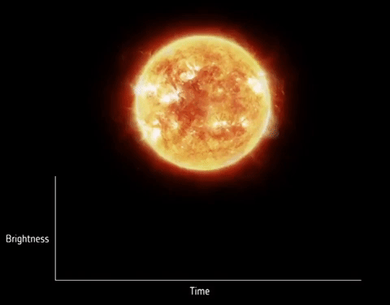

# exoplanet_transits

In this project we analyze data from NASA’s Transiting Exoplanet Survey Satellite (TESS), 
which was launched in April 2018. The data files contain time-series data for two stars
with transiting exoplanets.

A transit occurs when a planet passes between a star and its observer. A the planet is passing in front of its star and slightly dims its light. This dimming can be seen in light curves – graphs showing the brightness of the star over time. When the exoplanet passes in front of the star, the light curve will show a dip in brightness.

During its initial 2-year survey mission, TESS has used its 
array of wide-field cameras to monitor 200 000 of the brightest stars near the Earth to look 
for small dips in the light from the star that correspond to (exo)planets transiting the face of 
the star and blocking some of the light.

The two light curves of TESS target stars provided here are given as time series with the
first column showing the time in days (Barycentred Julian Date) and the second column showing 
the calibrated photoelectron count rates for the star (as electrons/sec). The light curves each cover about a 
month and the individual data points correspond to 2-minute intervals. There are gaps of a few days in the middle of the observations due to observing constraints on the satellite. 

We are trying to identyfy the transits and apply a fit using simple model as in the image below. 

